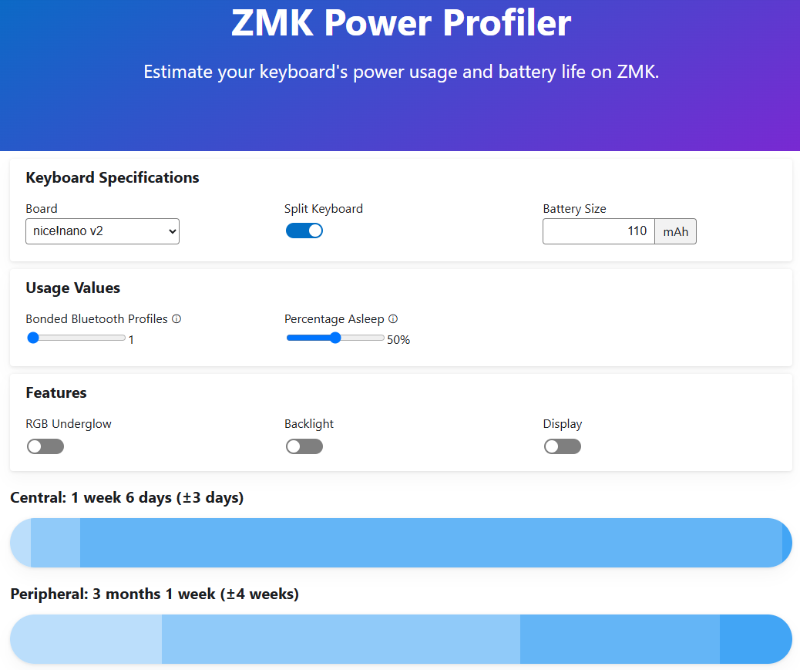

# Charging and Wired Connection

- The keyboard halves must be charged individually through their USB-C port, with the power switches turned on.

- Standard USB-C phone chargers (5V, 1A–2.4A) will also work.

- A blue light will appear near the USB-C port while charging. The light turns off when charging is complete.
  

> [!Note]  
> You can usually see the battery percentage of connected Bluetooth devices on your computer or phone.  
> Because of this, an OLED screen is not really needed, unless you use [these](https://typeractive.xyz/products/nice-view). Removing the OLED can greatly improve battery life.  
> If you want to use this keyboard through a USB-C wired connection without charging, both sides must be connected to your computer individually.  

> [!Warning]  
> Connecting only the right half will not work. However, connecting only the left half will work.  
> This is because the right half must first communicate with the left half before sending signals to the computer.  
> As a result, the battery on the left half drains faster than the right.  
 

- [ZMK Power Profiler](https://zmk.dev/power-profiler) - Please check this out to estimate your keyboard's power usage and battery life with different components.  
 

