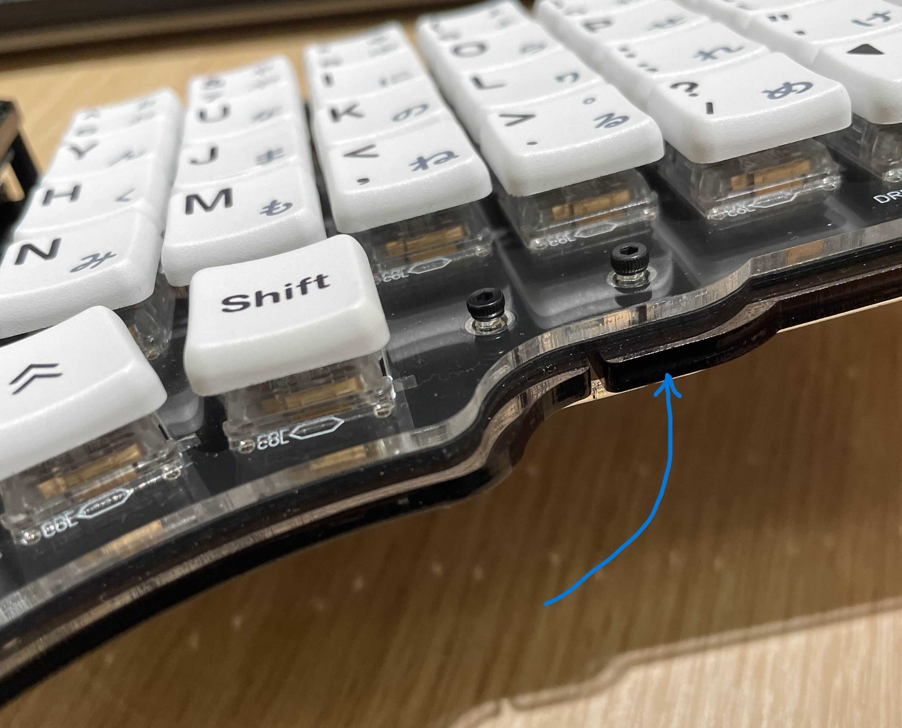

## Drift Keyboard Choc Conversion
This is how to convert to a low-profile choc version:  

### Basically you only have to remove one layer of the outer acrylic frame  
 

 - Disassemble your drift keyboard then remove all the brass standoffs  
 
 - Replace all the brass standoffs with 4mm brass standoffs  
 
 - Use 4mm M2 screws if they are not already that length  
 
 - You will need to use the Choc Plate which has smaller screw holes  
     
 
### This is what your Drift Keyboard should look like after the conversion:  
    

  

Only one layer of outer acrylic beneath the pcb, and the plate is now sandwiched with the pcb.