# How to Change your Keymap for the Drift V3 Keyboard (by Timception)

## Sign Up for a GitHub Account [HERE](https://github.com/)

### 1. Fork [This Repository](https://github.com/Timception/zmk-config-drift-v3-editor)  
  

### 2. Set Repository Name and Create Fork  
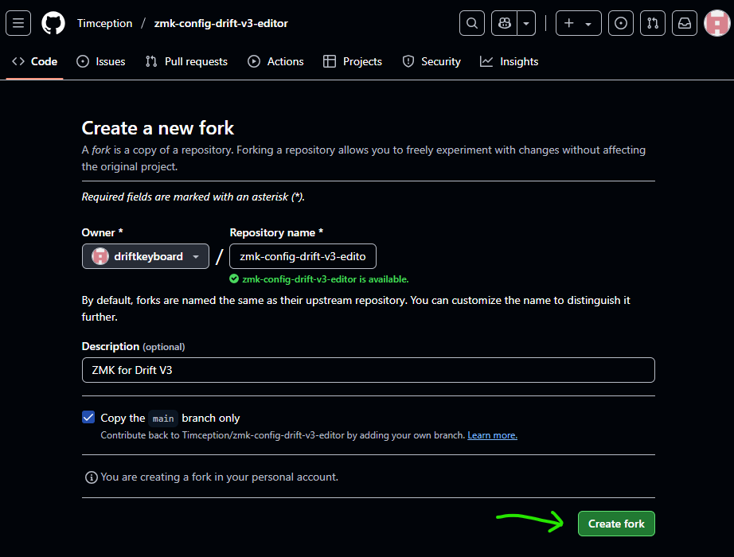  

### 3. Go to the Actions Tab  
  

### 4. Enable Workflows  
  

### 5. Click Build your ZMK Firmware  
  

### 6. Run Workflow  
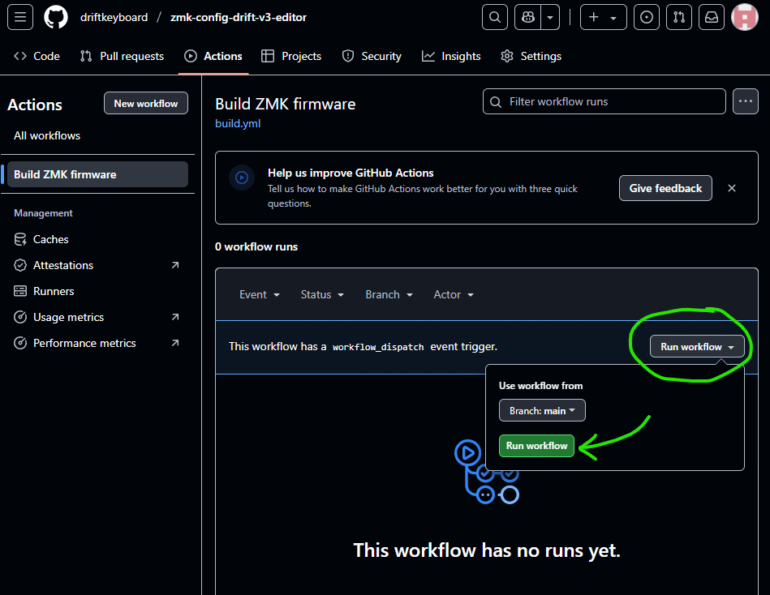  

### 7. Wait for GitHub to Compile Firmware Files  
  

### 8. Click the Firmware Link after Build Complete  
  

### 9. Download Firmware  
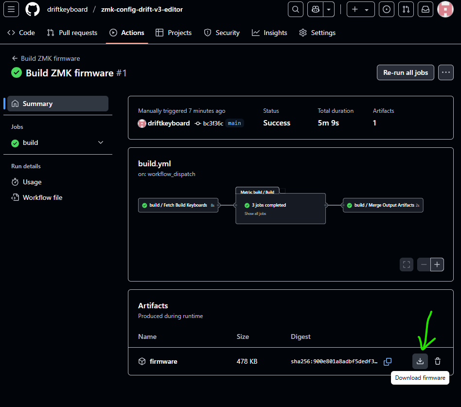  

### 10. Unzip to Find 3 Files: Firmware Files for the Left and Right Keyboard Halves and a Reset File  
This confirms that you can now make your own firmware. Next, let's try and change some keys.  
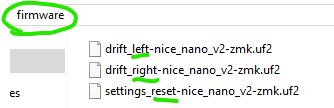  

### 11. Go Back to the Repository Page  
  

### 12. Click the [Keymap Editor Link](https://nickcoutsos.github.io/keymap-editor/)  
  

### 13. Authenticate with GitHub  
  

### 14. Authorize Keymap Editor  
  

### 15. Add Repository  
  

### 16. Add Select Repository - Drift V3  
  

### 17. After Installation - Keymap will Appear  
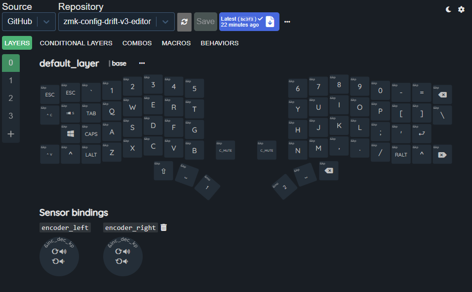  

### 18. Click the Layer Numbers to View Hidden Functions  
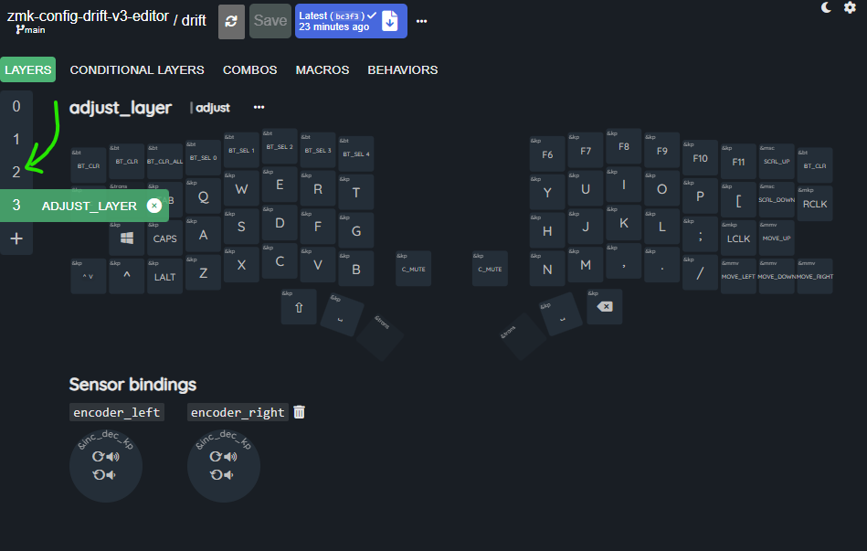  

### 19. You can Access the Bluetooth Functions by Pressing and Holding "mo2"  
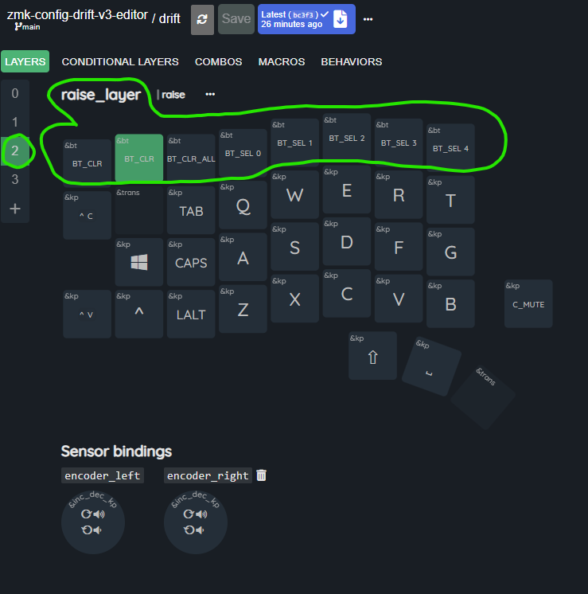  

### 20. Bluetooth Functions [(more on this here)](https://github.com/Timception/zmk-config-drift-v3-editor/tree/main/Testing%20or%20Fixing%20your%20Bluetooth%20Connection)  
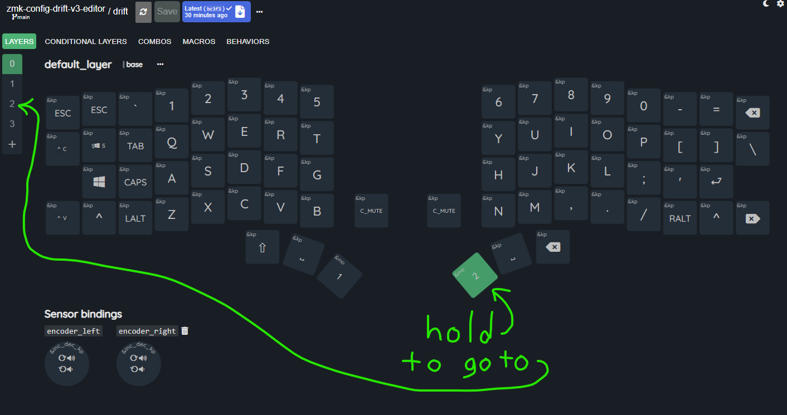  

### 21. Click the "Alt" Key to bring up the Behaviour Settings for that Key  
  

### 22. Click the Current Key in the Key Code Field  
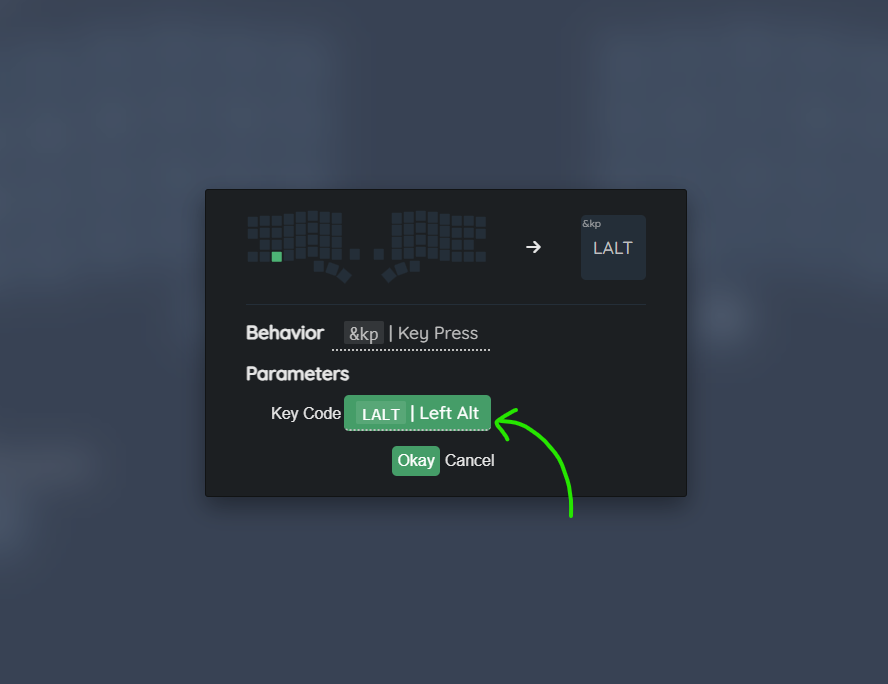  

### 23. Find the Shift Keycode by using the Search Bar then Click "Okay"  
  

### 24. Click "Save" at the top to Save your New Keymap  
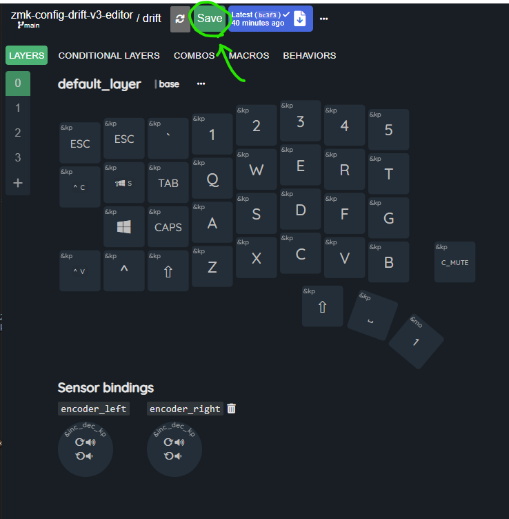  

### 25. Note the Changes you Made (optional) and Click "Commit"  
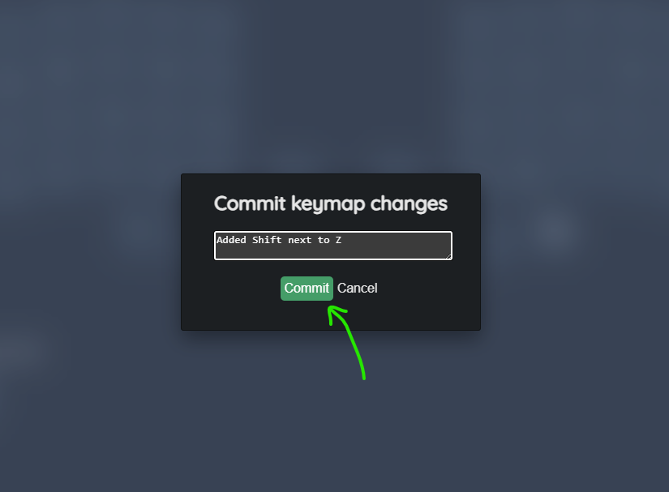  

### 26. Click Firmware File Link to go to the Firmware Building Page  
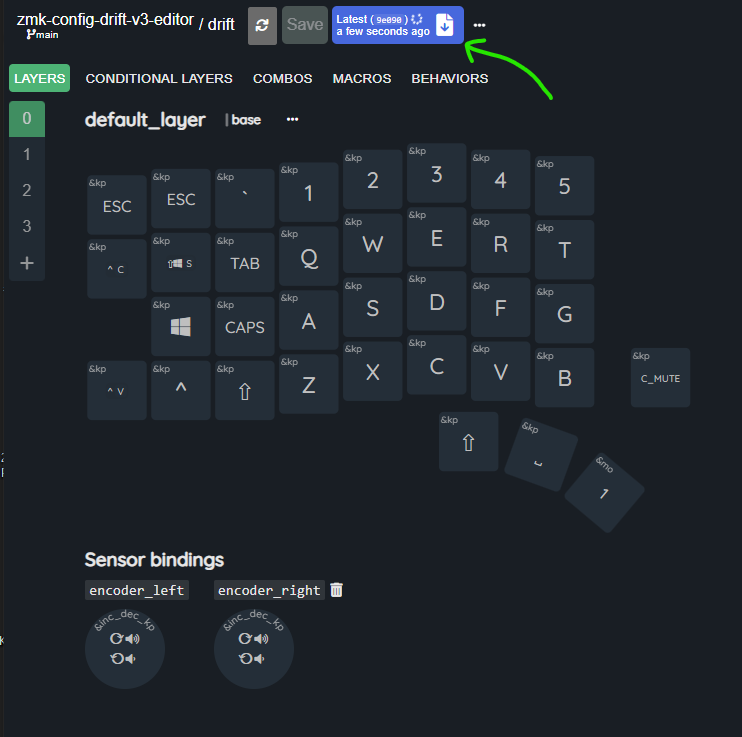  

### 27. Download New Firmware after Everything is Green and Complete  
  

### 28. Plug Left Half of the Drift Keyboard into your Computer then Double-Click the RESET Button  
  

### 29. A New Drive Should Appear (for you to upload your firmware file)  
  

### 30. Drop the Firmware for the Left Side into that Drive and Wait for Transfer to Complete  
  

### 31. Repeat Steps for the Right Half and Drop the Appropriate Firmware File into its Drive  
  

### 32. Test Keys Using This [Online Key Tester](https://www.keyboardtester.com/tester.html) or Download [Switch Hitter](https://www.majorgeeks.com/files/details/switch_hitter.html)  
  

## For more information on Behaviours and Key Codes please visit: (ZMK Behaviours)[https://zmk.dev/docs/keymaps/behaviors]  

## You can see more actual builds [-=HERE=-](https://www.instagram.com/majin_keyboards)  
