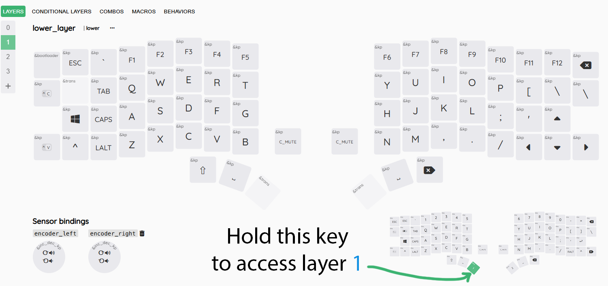
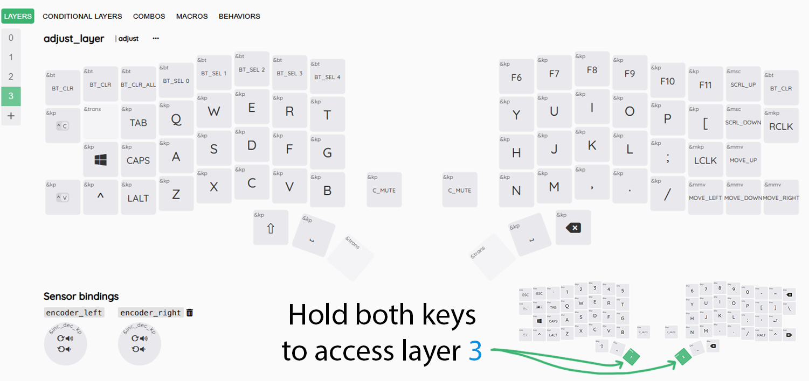

# Keymap

## Introduction  

- If you don't already know, this keyboard comes with open source firmware from ZMK that allows you to have more keys than you can see on your keyboard because they are on extra "layers" that you can access by pressing layer keys similar to the "Fn" (function) key on a laptop or notebook to access volume control or screen brightness etc.  

- Split Keyboards have some terminology and one that I would like to introduce you to is the "Thumb Cluster". The thumb cluster consists of the keys where you would normally press the spacebar. Split Keyboards make much better use of this area and allow you to place and customize more useful keys in this area so you don't have to reach so far to press them.  

- You can see that I have placed the shift and backspace keys on the default keymap for the Drift Keyboard. As well as putting the spacebar in the middle of each thumb cluster because some people hit the spacebar with their left thumb, while others may hit the spacebar with their right thumb.  

- You can [change the keys on your keymap](https://github.com/Timception/zmk-config-drift-v3-editor/tree/main/How%20to%20Change%20your%20Keymap) if you prefer different placing of any key.  

> [!Note]  
> If you are confused about what some of these keys represent, you may find [more information here](https://zmk.dev/docs/keymaps/list-of-keycodes).  
> Information on layers can also [be found here](https://zmk.dev/docs/keymaps/behaviors/layers).  

# The Default/Base Layer (Layer 0)  
- This is the default layer or layer 0 on this keyboard and the keys are as follows:  
      

# The Lower Layer (Layer 1)  
- This is the lower layer or layer 1. This is where the F-Keys and Arrow-Keys are:  
      

# The Raise Layer (Layer 2)  
- This is the lower layer or layer 2. This is where the Bluetooth Functions and Mouse Keys are:  
      

# The Adjust Layer (Layer 3)  
- This is the adjust layer or layer 3. This is pretty much a clone of Layer 2 as my usage doesn't go beyond 3 layers:  
      