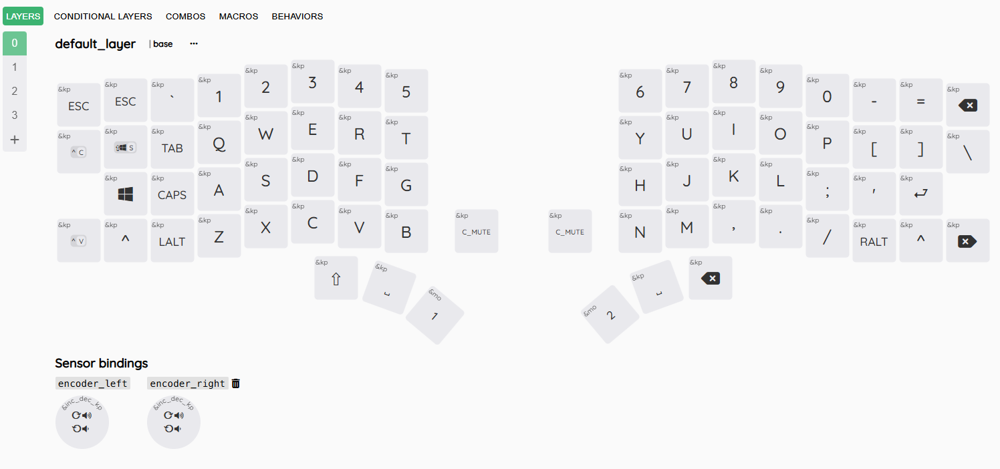

## Drift Keyboard V3 by Timception  

- This is the wireless [ZMK](https://zmk.dev/) version of the [Original Drift Keyboard](https://github.com/Timception/Drift)  

  - [Default Keymap](#default-keymap) to see where all your keys are, or go straight to the:  
  
    - [Keymap Editor by Nick Coutsos](https://nickcoutsos.github.io/keymap-editor/)  

- The PCB is not open source, but you could [contact me](https://www.instagram.com/majin.keyboards) if you would like a pair
     

## Quickstart Guide   
  - [1.	How to change your keys](/docs/change-keys/) - Detailed guide on how to change your keys  

  - [2.	How to install batteries](/docs/batteries/) - Along with other supported batteries  

  - [3.	Connecting through Bluetooth](/docs/bluetooth/) - Bluetooth connections and troubleshooting  

  - [4.	Charging](/docs/charging/) - How to charge the keyboard and use with USB-C  

  - [5.	Switching to low profile](/docs/low-profile/) - Remove some parts to use low profile switches  

  - [6.	3D Printables](https://github.com/Timception/3d-printables) - This will take you to the 3D printable part repository  
    

# Default Keymap

  - If you don't already know, this keyboard comes with open source firmware from [ZMK](https://zmk.dev/) that allows you to have more keys than you can see on your keyboard because they are on "extra layers" that you can access by pressing layer keys similar to the "Fn" (function) key on a laptop or notebook to access volume control or screen brightness etc.  

  - Split Keyboards have some terminology and one that I would like to introduce you to is the "Thumb Cluster". The thumb cluster consists of the keys where you would normally press the spacebar. Split Keyboards make much better use of this area and allow you to place and customize more useful keys in this area so you don't have to reach so far to press them.  

  - You can see that I have placed shift on the left-most thumb cluster key, and backspace on the right-most thumb cluster key. As well as putting the spacebar in the middle of each thumb cluster because some people hit the spacebar with their left thumb, while others may hit the spacebar with their right thumb.  

  - You can [change the keys on your keymap](/docs/change-keys/) if you prefer different placing of any key.  

> [!Note]  
> The "&trans" keys seen on the thumb clusters on layers 1 and above act as transparent keys, copying the key set on the layer beneath it.  
> If you are confused about what some of these keys represent, you may find [more information here](https://zmk.dev/docs/keymaps/list-of-keycodes)  
> Information on layers can also [be found here](https://zmk.dev/docs/keymaps/behaviors/layers)  

## Base/Default Layer (layer 0)  
- This is the default layer or layer 0 on this keyboard and the keys are as follows:  
  
      

## Lower Layer (layer 1)  
- This is the lower layer or layer 1. This is where the F-Keys and Arrow-Keys are:  
  
    
  The "&mo 1" key is held to access this layer as seen in the bottom right of this image.      

## Raise Layer (layer 2)  
- This is the lower layer or layer 2. This is where the Bluetooth Functions and Mouse Keys are:  
  
    
  The "&mo 2" key is held to access this layer as seen in the bottom right of this image.      

## Adjust Layer (layer 3)  
- This is the adjust layer or layer 3. This is pretty much a clone of Layer 2 as my usage doesn't go beyond 3 layers:  
  
    
   Both "&mo 1" and "&mo 2" keys are held to work together to activate the conditional layer function, taking us to layer 3.      

This version of the Drift Keyboard supports:  

 - 5-Pin MX switches (3-Pin switches will also work)  
 - Kailh Choc V1 switches  
 - Kailh Choc V2 switches  
   

How to [change your build](/docs/low-profile/) to use choc switches.  
   

  
   

>[!Warning]
>Important Note on LiPo Batteries  
>  
>LiPo (Lithium Polymer) batteries are considered a fire hazard due to their sensitivity
>to overcharging, punctures, or improper handling, which can lead to overheating or combustion.
>Because of strict shipping regulations, LiPo batteries cannot be included with this keyboard
>and must be purchased separately by the builder.  
>  
>Disclaimer: I am not responsible for any damage, injury, or loss resulting from the use,
>charging, or installation of LiPo batteries. Use at your own risk and follow all safety guidelines
>provided by the battery manufacturer.  
>  
>More on how to install batteries [here](/docs/batteries/)  
    

You can see more actual builds [HERE](https://www.instagram.com/majin.keyboards)  

This project was made possible thanks to the incredible support of [Friction](https://github.com/friction07)  
Your generosity truly made all the difference—thank you!  
