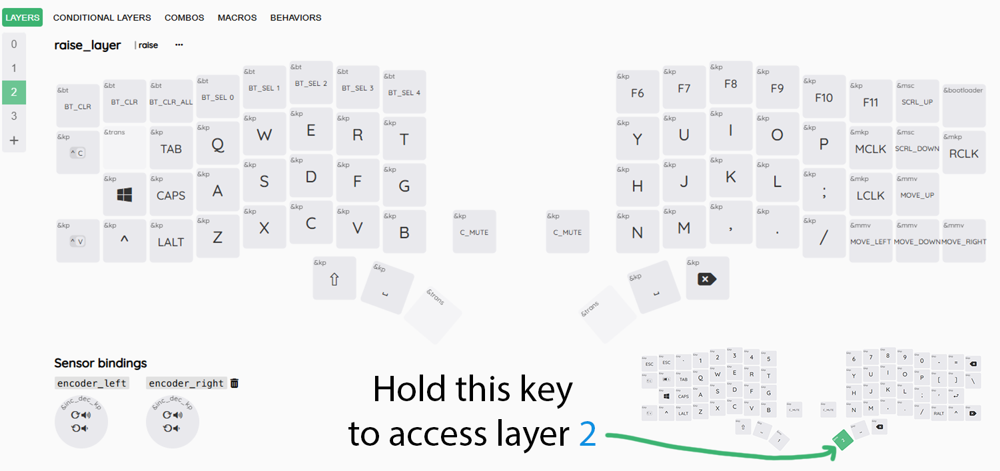

# Testing or Fixing your Bluetooth Connection

- ## Connect to Mutliple Devices  

  - Once you turn on your split keyboard you can clear the current bluetooth profile just to make sure it is available by pressing the BT_CLR or BT_CLR_ALL key on layer 2.  
  
  - You can enable/refresh bluetooth on your host device to search for this keyboard and connect to it. If it says unable to connect - you can try clicking on the device in the list repeatedly (I spam click in Windows until it connects).  
  
  - This keyboard has the ability to connect to 5 devices across 5 Profiles (BT_SEL 0 to BT_SEL 4).  
  
  - By holding down mo2 as shown below, you have access to the bluetooth functions on the top left half:
  -    
    
    - BT_CLR: Clear the connection between the keyboard and host for the selected profile.  
	
    - BT_CLR_ALL: Clear the connection between the keyboard and host for all profiles.  
	
    - BT_SEL 0 to BT_SEL 4: Pressing BT_SEL 0 will activate the first bluetooth profile, BT_SEL 1 will activate the second, and so on..  
	
    - If thirsty for more information [CLICK HERE](https://zmk.dev/docs/keymaps/behaviors/bluetooth)  

- ## Clearing a Bluetooth Profile (also removing keyboard from host device)  

  - After pressing BT_CLR or BT_CLR_ALL, you will also have to remove the device from your host. Usually this consists of going into the host device's bluetooth settings with bluetooth turned on and manually removing the drift keyboard from the list of devices (if any).  

    
